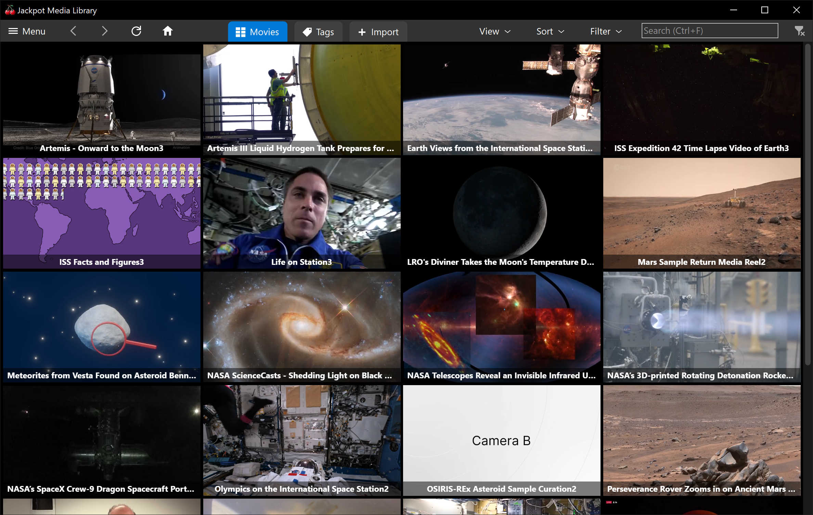

<h1 align="center"> Jackpot Media Library</h1>

### Browse and stream videos directly from S3-compatible storage
 
- Browse your collection as a wall of moving video clips.
- Stream videos using [VLC player](https://www.videolan.org/vlc/). No intermediate server needed.
- Fullscreen, mouse-driven design featuring [action buttons along the edges of the screen](https://en.wikipedia.org/wiki/Fitts%27s_law).
- Organize your media with simple tagging and filtering.
- Apple devices and other non-Windows devices can stream videos through your main Jackpot installation. Sync your library to `.m3u8` files and share them over the local network.
- All content is secured with standard AES-encrypted `.zip` files.

 

## Pricing

Jackpot is free and open source.
You'll just need an S3-compatible cloud storage account with monthly costs based on storage and streaming data used.

<table>
<tr>
<td>&nbsp;</td>
<th align="center">🥇 <a href="https://www.backblaze.com/cloud-storage" rel="nofollow">Backblaze&nbsp;B2</a></td>
<th align="center">🥈 <a href="https://www.cloudflare.com/developer-platform/r2/" rel="nofollow">Cloudflare&nbsp;R2</a></td>
<th align="center">💸 <a href="https://aws.amazon.com/s3/" rel="nofollow">Amazon&nbsp;S3</a></td>
</tr>
<tr>
<td align="right"><i>Storage:</i></td>
<td>$6 per TB</td>
<td>$15 per TB</td>
<td>$1&ndash;$23 per TB</td>
</tr>
<tr>
<td align="right"><i>Included streaming:</i></td>
<td>3 × storage</td>
<td>Unlimited</td>
<td>100 GB</td>
</tr>
<tr>
<td align="right"><i>Additional streaming:</i></td>
<td>1¢ per GB</td>
<td>&mdash;</td>
<td>9¢ per GB</td>
</tr>
</table>

## Requirements

- Windows 10 (version 20H1) or higher
- S3-compatible cloud storage account
- Internet speed: 20&nbsp;Mbps per 1080p stream
- Video files in MP4 format (Jackpot does not reencode videos)

## Alternatives

A USB drive is the simplest solution for most users: affordable, fast, and works offline. Media server software like [Jellyfin](https://jellyfin.org/), [Emby](https://emby.media/index.html), and [Plex Media Server](https://en.wikipedia.org/wiki/Plex_Inc.#Plex_Media_Server) can provide streaming and organization features. These are mature platforms with large communities, though they focus on commercial TV shows and movies and require technical knowledge to set up.

Consumer cloud storage like [OneDrive](https://en.wikipedia.org/wiki/OneDrive) and [Dropbox](https://en.wikipedia.org/wiki/Dropbox) offer video streaming, but they transcode videos to lower quality, have slow startup times, and lack native player integration. They can be convenient for small personal collections, but they don't provide end-to-end encryption and can be cumbersome for large libraries.

Jackpot aims for a middle ground: direct streaming from cheap cloud storage with end-to-end encryption, no quality loss, and minimal setup.
