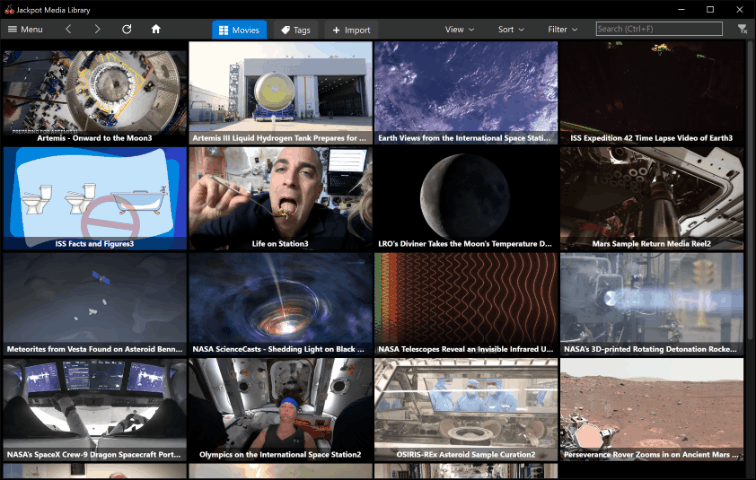

<h1 align="center"> Jackpot Media Library</h1>

<h3 align="center"><i>Free Windows app to browse and stream videos directly from <a href="https://www.backblaze.com/cloud-storage">Backblaze B2</a> cloud storage</i></h3>

<h3 align="center">Browse a wall of moving video clips</h3>

<h3 align="center">Fullscreen, mouse-driven design</h3>

Action buttons are along the edges of the screen.

<h3 align="center">Organize media with tagging</h3>

Create your own tags and apply them to videos.

<h3 align="center">No server and no complex setup</h3>

Jackpot is a Windows app that comes with everything you need. It runs on your computer and connects directly to the cloud storage provider.

<h3 align="center">Standard file formats with end-to-end encryption</h3>

Imported <code>MP4</code> videos are losslessly encoded into streaming-ready <code>M3U8</code> + <code>TS</code> format. All data in the cloud is stored in AES-encrypted <code>ZIP</code> files with a password that only you know. 

<h3 align="center">Stream videos using the <a href="https://www.videolan.org/vlc/">VLC app</a></h3>

Jackpot integrates with the best Windows video player. Share a folder of <code>M3U8</code> files to allow non-Windows devices to stream videos through your PC.

## Pricing

The Jackpot app is free and open source.
You just need a [Backblaze B2 account](https://www.backblaze.com/sign-up/cloud-storage).
They charge monthly based on storage used and data transferred.
Any S3-compatible provider will work, but Backblaze is the cheapest.
Prices are in U.S. dollars.

<table>
<tr>
<td align="right"><i>Storage:</i></td>
<td>$6 / TB / month</td>
</tr>
<tr>
<td align="right"><i>Free streaming:</i></td>
<td>3x total storage each month</td>
</tr>
<tr>
<td align="right"><i>Additional streaming:</i></td>
<td>1¢ per GB</td>
</tr>
<tr>
<td align="right"><i>Uploading:</i></td>
<td>Free</td>
</tr>
</table>

## Requirements

- Windows 10 (20H1) or newer.
- S3-compatible storage account.
- Fast, reliable Internet connection.
- Your videos must be in MP4 format. If they aren't, you'll have to transcode them using [ffmpeg](https://ffmpeg.org/) or [Handbrake](https://handbrake.fr/) first.
